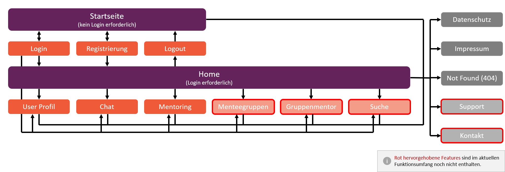
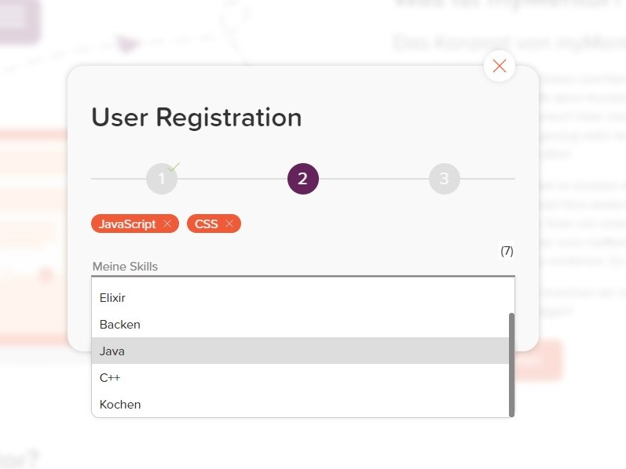
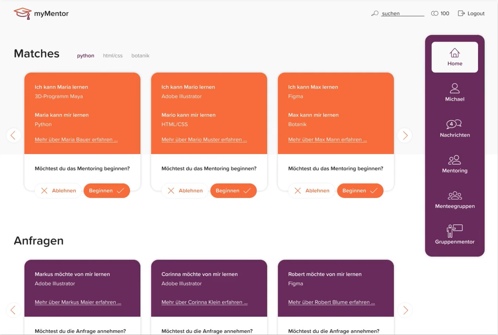
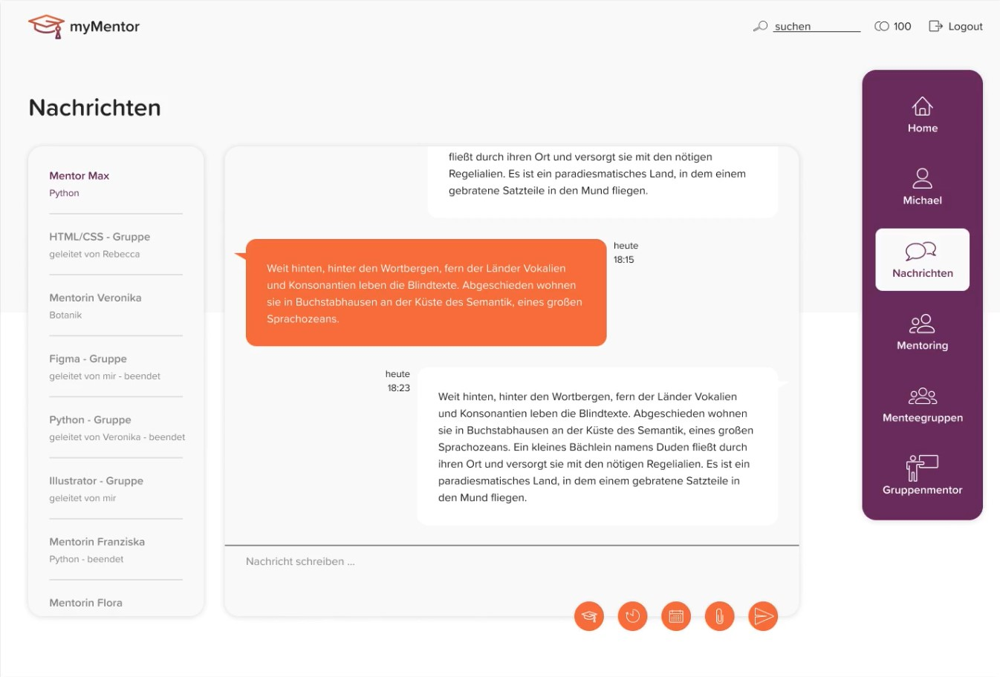
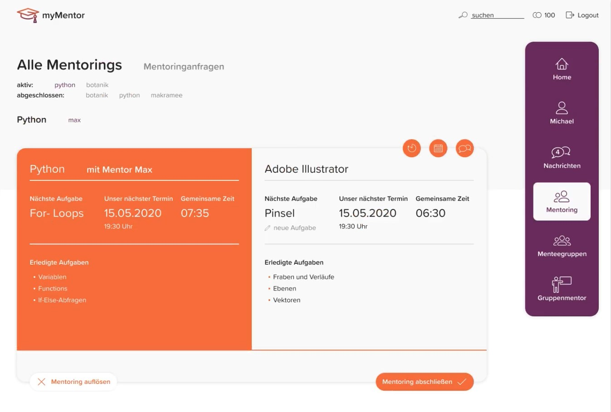
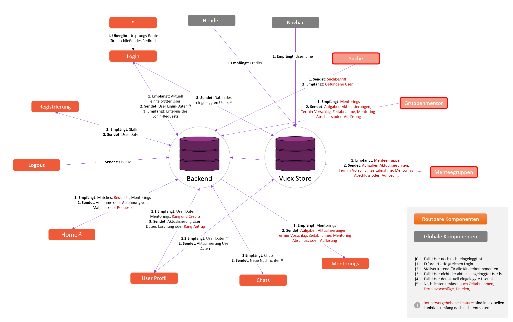

# myMentor
This team project was part of a fullstack web development course of the fourth semester at university. The goal was to create a web application with the suggested technologies Vue.js for the frontend and Phoenix + Elixir for the backend. We came up with the idea of myMentor. This is a digital platform allowing users to share knowledge and skills with other people. The main feature is a matching system. Users specify their skills and the skills they want to learn and the system will present matches who could teach whom (aka. mentorings). 

Since, my part was to create the frontend, no backend code or design concepts will be provided in this repo. However, I’ve added some screenshots from the presentation of this project to get an impression of the features and the implementation.

## Site structure and screenshots
myMentor is structured as visualized in the sitemap-diagram and described as following:

The landing page introduces the concept of myMentor and its advantages for users. From there, users can register themselves or login, if they have already an account. 
If the user is signed in, he or she will come to the home section. All found matches will be presented here. On the right side of the page the user can navigate to different sections e.g., chat rooms, mentorings, profile management and more. 
And of course, there are basic sites like a 404-, privacy- and an about-page.

### Sitemap (german translation)


### Landing page


### User registration


### Home section


### Chat room


### Mentoring


## Data flow
This diagram was also part of the project presentation and explains how data gets handled within the frontend. All information will be provided by the backend. Currently, no caching is implemented, so every detail has to be requested on the fly. Red highlighted features are not implemented, yet.




## Node.js instructions
Please note: No backend is available. Basic features like the landing page, 404 etc. will work, everything where user credentials are involved will fail. 

### Project setup
```
npm install
```

### Compiles and hot-reloads for development
```
npm run serve
```

### Compiles and minifies for production
```
npm run build
```

### Lints and fixes files
```
npm run lint
```
